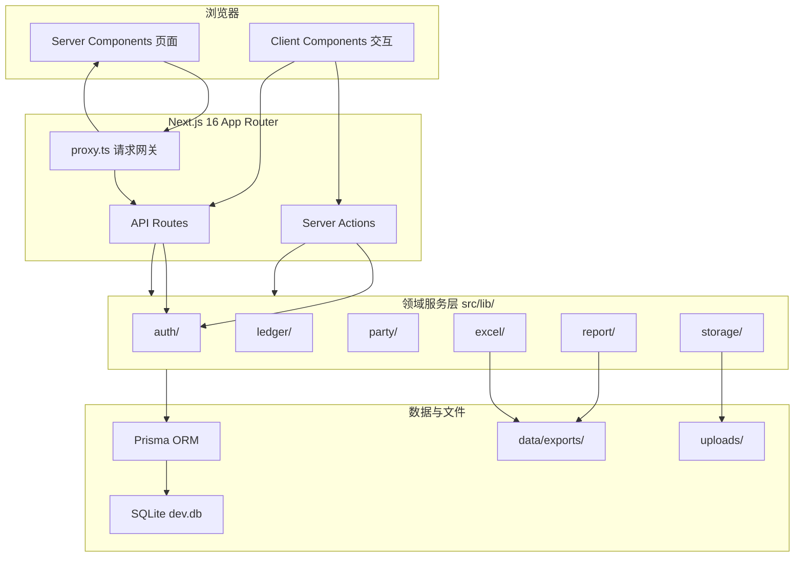
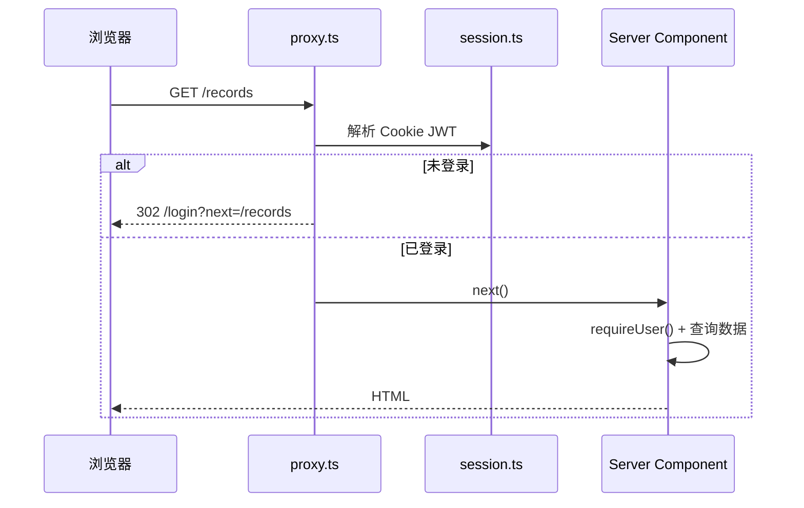
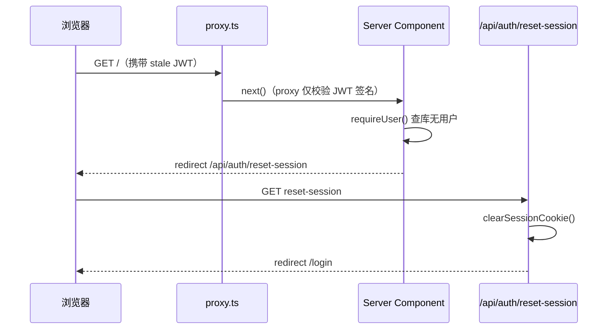
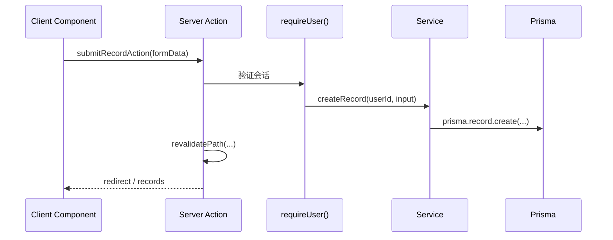
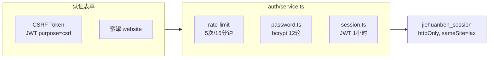
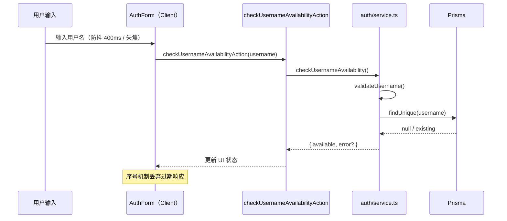
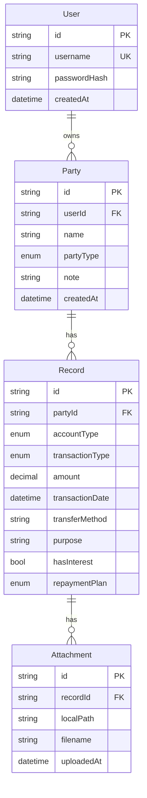
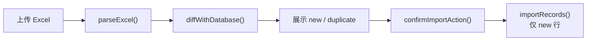

# 借还本 MVP — 架构设计

> 文档版本：与当前代码同步（2026-08）  
> 适用目录：`mvp/`

---

## 1. 架构总览



**设计原则**：

- **服务端优先**：页面数据在 Server Component 中直接读取，减少客户端状态
- **薄 Action、厚 Service**：Server Action 负责鉴权与参数校验，业务逻辑集中在 `src/lib/`
- **API 仅用于二进制**：Excel/PDF 下载与文件流服务走 API Route，其余走 Server Action

---

## 2. 技术栈

| 层级 | 技术 | 版本 |
|------|------|------|
| 框架 | Next.js（App Router） | 16.2.11 |
| UI | React | 19.2.4 |
| 样式 | Tailwind CSS | 4.x |
| ORM | Prisma | 6.19.0 |
| 数据库 | SQLite | 文件型 |
| 认证 | jose（JWT）+ bcryptjs | 6.2.8 / 3.0.3 |
| Excel | exceljs | 4.4.0 |
| PDF | pdfkit | 0.19.1 |
| 图表 | recharts | 2.15.4 |
| 日期 | date-fns | 4.1.0 |
| 测试 | vitest | 2.1.9 |
| 运行时 | Node.js | 20+ |

---

## 3. 目录结构

```
mvp/
├── prisma/
│   ├── schema.prisma          # 数据模型定义
│   ├── seed.ts                # 演示数据填充
│   └── migrations/            # SQLite 迁移历史
├── src/
│   ├── proxy.ts               # 请求鉴权网关（Next.js 16 替代 middleware）
│   ├── app/
│   │   ├── (auth)/            # 登录、注册（独立 layout）
│   │   ├── actions/           # Server Actions
│   │   │   ├── auth.ts
│   │   │   ├── records.ts
│   │   │   ├── parties.ts
│   │   │   └── import.ts
│   │   ├── api/
│   │   │   ├── auth/reset-session/  # 清除失效会话 Cookie
│   │   │   ├── export/              # Excel 导出
│   │   │   ├── export/analysis/     # PDF 报告
│   │   │   └── files/[...path]/    # 附件访问
│   │   ├── charts/            # 图表页
│   │   ├── parties/           # 相关方管理
│   │   ├── records/           # 流水 CRUD
│   │   ├── settings/data/     # 数据管理
│   │   ├── layout.tsx         # 根布局 + Nav
│   │   └── page.tsx           # 概览首页
│   ├── components/            # UI 与业务组件
│   └── lib/
│       ├── auth/              # 会话、CSRF、密码、限流
│       ├── ledger/            # 余额引擎、流水 CRUD
│       ├── party/             # 相关方服务
│       ├── excel/             # Excel 解析/导出/导入 diff
│       ├── report/            # PDF 分析报告
│       ├── storage/           # 本地文件存储
│       ├── db/client.ts       # Prisma 单例
│       ├── logger.ts          # 结构化日志
│       └── labels.ts          # 枚举中文映射
├── scripts/                   # CLI 工具（inspect、smoke-test 等）
├── uploads/                   # 运行时附件目录（gitignore）
├── data/exports/              # 导出备份目录（gitignore）
└── public/                    # 静态资源
```

---

## 4. 请求处理流程

### 4.1 页面访问



`proxy.ts` 配置：

- **公开路径**：`/login`、`/register`、`/api/auth/reset-session`
- **matcher**：排除 `_next/static`、`_next/image`、`favicon.ico`
- **不在 proxy 层**根据 JWT 将已登录用户从 auth 页重定向到 `/`（避免 JWT 有效但用户已删除时的 `/ ↔ /login` 死循环；改由登录/注册页 `getOptionalUser` 处理）
- 未登录访问受保护页面 → 重定向 `/login?next=...`
- 未登录访问 API → `401 { error: "未登录" }`

### 4.1.1 失效会话处理

当 Cookie 中 JWT 仍有效，但数据库用户已被删除（如执行 `db:seed` 清库）时：



**设计要点**：

- Cookie 只能在 **Server Action** 或 **Route Handler** 中修改，Server Component 渲染时不可调用 `cookies().delete()`
- `requireUser()` 发现用户不存在时重定向至 `STALE_SESSION_RESET_PATH`（`/api/auth/reset-session`），由 Route Handler 清除 Cookie
- `getOptionalUser()` 在用户不存在时返回 `null`（不删 Cookie），登录页仍可正常展示

### 4.2 数据变更（Server Action）



所有 Action 文件顶部声明 `"use server"`，入口统一调用 `requireUser()` 获取当前用户 ID。

### 4.3 文件下载（API Route）

| 路由 | 方法 | 职责 |
|------|------|------|
| `/api/export` | GET | 生成 Excel Buffer，设置 `Content-Disposition` |
| `/api/export/analysis` | GET | 生成 PDF Buffer |
| `/api/auth/reset-session` | GET | 清除会话 Cookie，重定向 `/login` |
| `/api/files/[...path]` | GET | 读取 `uploads/` 下文件并返回 |

API Route 内再次校验会话（`getSessionFromRequest`），与 proxy 形成双重保护。

---

## 5. 认证架构



| 模块 | 文件 | 职责 |
|------|------|------|
| 会话 | `lib/auth/session.ts` | JWT 签发/验证，Cookie 读写 |
| CSRF | `lib/auth/csrf.ts` | 独立 JWT，`purpose: "csrf"` |
| 密码 | `lib/auth/password.ts` | bcrypt 哈希与校验 |
| 校验 | `lib/auth/validation.ts` | 用户名/密码规则 |
| 限流 | `lib/auth/rate-limit.ts` | 内存 Map，进程级 |
| 入口 | `lib/auth/service.ts` | register/login/logout/requireUser/checkUsernameAvailability |
| Action | `app/actions/auth.ts` | 表单 action、CSRF 刷新、用户名查重 action |

**环境变量**：

| 变量 | 必填 | 说明 |
|------|------|------|
| `AUTH_SECRET` | ✅ | JWT 签名密钥，≥16 字符 |
| `DATABASE_URL` | ✅ | SQLite 连接串 |

### 5.1 注册用户名查重



**客户端防竞态**：`usernameCheckSeq` 递增序号，异步返回时若序号不是最新则丢弃结果，避免快速输入时旧请求覆盖新结果。

**服务端双重校验**：实时查重 + 注册提交时 `registerUser()` 再次查重，数据库 `@unique` 作为最终兜底。

## 6. 数据模型



**约束与索引**：

- `Party`：`@@unique([userId, name])`，同名相关方 per-user 唯一
- `User` 删除 → 级联删除其 Party → 级联删除 Record → 级联删除 Attachment
- `Record` 索引：`partyId`、`transactionDate`

**枚举**：

```
AccountType:     RECEIVABLE | PAYABLE
TransactionType: BORROW     | REPAY
RepaymentPlan:   LUMP_SUM   | INSTALLMENT | UNSPECIFIED
PartyType:       RELATIVE   | FRIEND      | ORGANIZATION
```

---

## 7. 核心业务：余额引擎

实现位置：`src/lib/ledger/service.ts`

### 7.1 增量计算

```typescript
// 伪代码 — 与实际实现一致
function computeBalanceDelta(accountType, transactionType, amount) {
  const sign = transactionType === "BORROW" ? 1 : -1;
  if (accountType === "RECEIVABLE") return { receivable: sign * amount, payable: 0 };
  return { receivable: 0, payable: sign * amount };
}
```

### 7.2 聚合查询

| 函数 | 用途 |
|------|------|
| `getSummary(userId)` | 首页总应收/应付 + 按方汇总 |
| `getPartyBalance(userId, partyName)` | 单方详情页 |
| `getAnnualChartData(userId)` | 图表页年末余额 |
| `previewRecord(userId, input)` | 记一笔预览 |
| `listRecords(userId, filter)` | 流水列表 |
| `createRecord` / `updateRecord` / `deleteRecord` | CRUD |

所有查询均带 `party: { userId }` 过滤，确保数据隔离。

### 7.3 预览逻辑

提交前调用 `previewRecordAction`：

1. 查找相关方当前余额
2. 计算操作后的 delta
3. 若结果余额 < 0，返回 warning（不阻止提交，仅提示）

---

## 8. Excel 模块

实现位置：`src/lib/excel/service.ts`

### 8.1 导出

```
getExportWorkbook(userId)
  ├── Sheet「相关方」: name, partyType, note
  └── Sheet「借还流水」: accountType, transactionType, partyName, amount, ...
```

### 8.2 导入



**去重键**：`accountType + partyName + transactionType + amount + date + transferMethod + purpose`

**相关方处理**：导入时 `findOrCreatePartyForImport` 自动 upsert。

---

## 9. PDF 报告模块

| 文件 | 职责 |
|------|------|
| `lib/report/analysis.ts` | 从 DB 聚合 `AnalysisReport` 数据结构 |
| `lib/report/pdf.ts` | PDFKit 渲染，注册系统中文字体 |
| `app/api/export/analysis/route.ts` | HTTP 入口 |

**洞察生成**（`buildInsights`）：纯规则引擎，例如：

- 净头寸为正/负的文案提示
- 长期未还款相关方提醒
- 年度借还比例异常提示

不涉及 LLM 或外部 AI 服务。

---

## 10. 文件存储

实现位置：`src/lib/storage/local.ts`

```
uploads/
└── {recordId}/
    └── {originalFilename}
```

- 写入：`saveAttachment(recordId, file)`
- 读取：API Route 拼接路径，拒绝 `..` 路径穿越
- 删除记录时依赖 Prisma cascade 清理 Attachment 行；物理文件清理在 service 层处理

---

## 11. 日志系统

实现位置：`src/lib/logger.ts`

| 类别 | 事件示例 |
|------|---------|
| `auth` | login.success / login.failure / register.* / csrf.invalid |
| `access` | access.authenticated / access.unauthenticated / auth_page.* |
| `api` | api.unauthorized / export.error |

- 时间戳：`Asia/Shanghai` 时区格式化
- IP 来源：`x-forwarded-for` → `x-real-ip` → fallback
- 输出：stdout/stderr，无外部日志服务

---

## 12. 前端架构

### 12.1 渲染策略

| 类型 | 示例 | 策略 |
|------|------|------|
| 数据页 | 概览、流水列表、图表 | Server Component 直读 DB |
| 交互页 | 记一笔表单、导入、批量删除 | Client Component + Server Action |
| 认证页 | 登录/注册 | Server 生成 CSRF + Client 表单 |

### 12.2 关键组件

| 组件 | 文件 | 职责 |
|------|------|------|
| Nav | `components/nav.tsx` | 顶栏导航 + 退出 |
| RecordForm | `components/record-form.tsx` | 记一笔三步流程 |
| RecordsTable | `components/records-table.tsx` | 流水表格 + 筛选 + 批删 |
| PartyManagementPanel | `components/party-management-panel.tsx` | 相关方 CRUD |
| DataManagement | `components/data-management.tsx` | 导入/导出 UI |
| AuthForm | `components/auth-form.tsx` | 登录/注册 + CSRF 刷新 + 注册用户名防抖查重 |
| AnnualChart | `components/annual-chart.tsx` | Recharts 柱状图 |

### 12.3 样式

- Tailwind CSS 4 + `globals.css` 全局变量
- 主色调：emerald（品牌）+ stone（中性灰）
- 无独立 UI 组件库，基础组件在 `components/ui/`

---

## 13. 测试架构

```
vitest.config.ts
├── environment: node
├── fileParallelism: false    # 避免 SQLite 并发冲突
├── setupFiles: vitest.setup.ts  # migrate deploy → test.db
└── tests:
    ├── src/proxy.test.ts
    ├── src/lib/ledger/ledger.test.ts
    ├── src/lib/excel/excel.test.ts
    ├── src/lib/auth/csrf.test.ts
    ├── src/lib/auth/username-availability.test.ts
    ├── src/lib/amount-format.test.ts
    └── src/lib/date-input.test.ts
```

**CLI 脚本**（`scripts/`，非自动化测试）：

| 脚本 | 用途 |
|------|------|
| `smoke-test.ts` | 端到端冒烟（test 用户） |
| `inspect-db.ts` | 查看数据库概况 |
| `inspect-users.ts` | 列出用户 |
| `clear-all-data.ts` | 清空所有数据 |
| `analyze-data.ts` | 控制台输出分析 JSON |
| `stop-dev.ts` | 停止 dev 服务器（解决 Windows EPERM） |

---

## 14. 部署与本地开发

### 14.1 本地启动

```bash
cd mvp
npm install          # postinstall → prisma generate
cp .env.example .env.local
npx prisma migrate dev
npm run db:seed      # 可选：填充演示数据
npm run dev          # http://localhost:3000
```

### 14.2 生产构建

```bash
npm run build
npm run start
```

### 14.3 数据文件位置

| 路径 | 内容 |
|------|------|
| `prisma/prisma/dev.db` | SQLite 数据库（Prisma 相对路径解析） |
| `uploads/` | 用户上传凭证 |
| `data/exports/` | 导出备份 |

以上目录均在 `.gitignore` 中，不进入版本控制。

### 14.4 Windows 注意事项

- 开发服务器运行时执行 `prisma generate` 可能 EPERM → 先 `npm run dev:stop`
- 已从 `package.json` 移除 `predev` 钩子以避免此问题

---

## 15. 安全设计

| 措施 | 实现 | 状态 |
|------|------|------|
| 路由保护 | `proxy.ts` 全局拦截 | ✅ |
| 密码存储 | bcrypt 12 轮 | ✅ |
| 会话安全 | httpOnly + JWT 过期 | ✅ |
| CSRF | 登录/注册 Token 校验 | ✅ |
| 速率限制 | 内存计数器 | ✅（单进程） |
| 路径穿越 | 文件 API 拒绝 `..` | ✅ |
| 开放重定向 | `next` 参数白名单 | ✅ |
| 用户数据隔离 | 查询层 userId 过滤 | ✅ |
| 失效会话清理 | `/api/auth/reset-session` Route Handler | ✅ |
| Cookie 修改约束 | 仅 Server Action / Route Handler 可写 Cookie | ✅ |
| 附件归属校验 | 文件 API 验证 record 属于当前用户 | ⚠️ 待加强 |
| 附件大小/类型限制 | — | ⚠️ 未实现 |
| 分布式限流 | — | ⚠️ 内存级，多实例不共享 |

---

## 16. 扩展点（未来参考）

以下为当前架构预留或可平滑扩展的方向，**均未实现**：

| 方向 | 建议方案 |
|------|---------|
| 家庭组共享 | 新增 `Household` 模型，Party/Record 关联 householdId |
| 云端部署 | SQLite → PostgreSQL，uploads → S3/OSS |
| 分布式限流 | Redis 替代内存 Map |
| 附件安全 | API Route 增加 record.userId 校验 |
| 通知提醒 | 定时任务 + 邮件/微信服务 |
| 利息计算 | 扩展 ledger service，新增计息策略 |

---

## 17. 相关文档

| 文档 | 路径 |
|------|------|
| 产品需求 | `mvp/产品需求.md` |
| 快速开始 | `mvp/README.md` |
| 环境变量示例 | `mvp/.env.example` |
